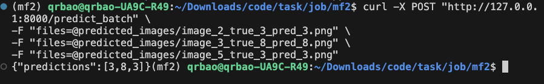

### リンクを間違えてしまい、大変申し訳ありません。もし「Learning Journal on Building Autonomous Driving Simulation Environments Using EMerNeRF」にご興味がございましたら、以下のリンクをクリックしてください。
https://drive.google.com/file/d/1dh-5X2x4w-XZwqOuDzji7oe-8B3ByfXQ/view?usp=sharing
---
# Hiragana Character Classification Project


## Project Overview
This project utilizes the Kuzushiji-49 dataset to train a convolutional neural network model for the recognition and classification of Hiragana characters. The project includes three main components: model training, image loading, and API implementation, which allows for model prediction and results validation.

## Project Directory Structure

```plaintext
project-root
├── checkpoints              # Directory for saving the trained model
├── data                     # Directory for storing raw Kuzushiji-49 dataset
├── MFkmnist.ipynb           # Notebook for additional experiments or analysis
├── predicted_images         # Directory for saving predicted images example
├── __pycache__              # Python cache directory
├── README.md                # Project documentation
└── webapi.py                # Web API implementation
```

## File Descriptions

- **kmnistTraing.ipynb**: Contains code for loading data, defining the model, training, and saving the model. After running this notebook, the trained model will be saved in the `checkpoints` folder.
- **image_loader.ipynb**: Responsible for downloading and extracting Kuzushiji-49 dataset images into the `kuzushiji49_images` folder and then you can randomly selecting images to test the Web API’s prediction.
- **webapi.py**: Implements a Web API using FastAPI, which receives uploaded images and returns classification predictions. The API supports batch prediction.

## Running Instructions

### 1. Environment Setup

Before running the project, ensure the following dependencies are installed:

```bash
!pip install matplotlib==3.6.2
!pip install pandas==1.5.3
!pip install torch==1.13.1
!pip install torchvision==0.14.1
!pip install tqdm==4.64.1
!pip install requests
!pip install fastapi==0.88.0
!pip install uvicorn==0.18.3
!pip install pillow==9.3.0
!pip install python-multipart==0.0.5
```

### 2. Project Execution Steps

#### Step 1: Train the Model
Run `kmnistTraing.ipynb` in the project’s root directory to train the model. The trained model will be saved as `checkpoints/best_model1.pth`.

#### Step 2: Start the Web API

1. First, check if port 8000 is in use to ensure it is free. To find any processes using port 8000 (Linux or MacOS), run:

   ```bash
   lsof -i :8000
   ```

2. If the port is occupied, terminate the process with the following command:

   ```bash
   kill -9 <PID>  # Replace <PID> with the actual process ID
   ```

3. In the root directory, start the Web API with the following command:

   ```bash
   uvicorn webapi:app --reload
   ```

   Once started, the API will be available at `http://127.0.0.1:8000`.

#### Step 3: Test the Web API

In another terminal, use the following `curl` command to test the API endpoint:

```bash
curl -X POST "http://127.0.0.1:8000/predict_batch" \
-F "files=@path/to/image1.png" \
-F "files=@path/to/image2.png" \
-F "files=@path/to/image3.png"
''' for example 
curl -X POST "http://127.0.0.1:8000/predict_batch" \
-F "files=@predicted_images/image_2_true_3_pred_3.png" \
-F "files=@predicted_images/image_3_true_8_pred_8.png" \
-F "files=@predicted_images/image_5_true_3_pred_3.png"
'''

```

- `file=@path/to/your/test_image.png`: Replace with the path to the image you want to test.
- The API will return the classification prediction for the image.

## Notes

1. **Port Check**: Ensure port 8000 is available before starting the API.
2. **Execution Order**: Run `kmnistTraing.ipynb` to generate the trained model, then `image_loader.ipynb` to extract test images, and finally start `webapi.py` to run the API.
3. **Batch Testing**: The `webapi.py` script supports batch image upload and prediction. Refer to FastAPI documentation for further testing details.
4. **Web API Results Display**:

   | Specification     | Detail                                          |
   |-------------------|-------------------------------------------------|
   | **Endpoint URL**  | `http://127.0.0.1:8000/predict_batch`           |
   | **Method**        | `POST`                                          |
   | **Input Parameter** | `files` (multiple image files, `multipart/form-data`) |
   | **Output**        | JSON array of predictions, e.g., `"predictions": [3, 8, 3]` |
   | **Error Handling** | JSON error messages for missing fields or invalid formats |


   

## Future Improvements

- **Pending Items**: Due to time constraints, some model parameter tuning has not been fully explored.
- **Future Enhancements**: In future versions, deeper network architectures and optimized hyperparameter configurations could be introduced to further improve model accuracy.
